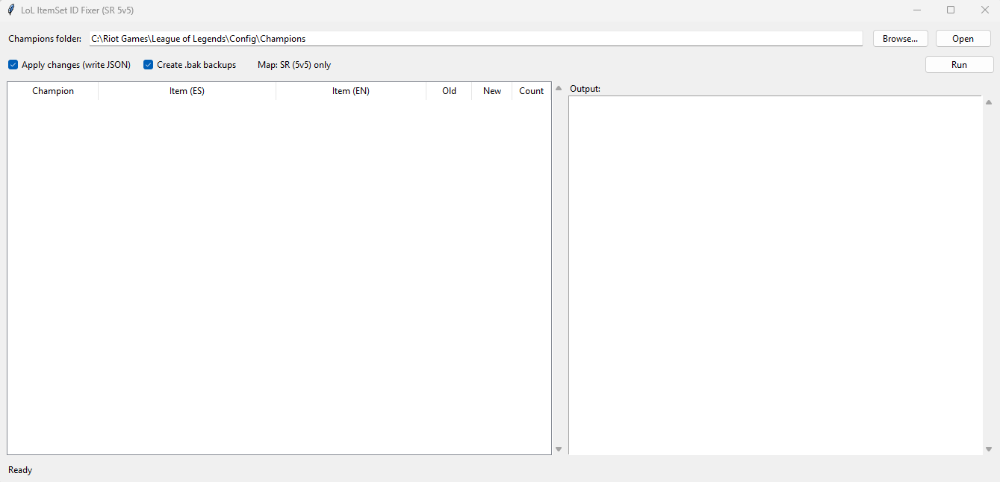
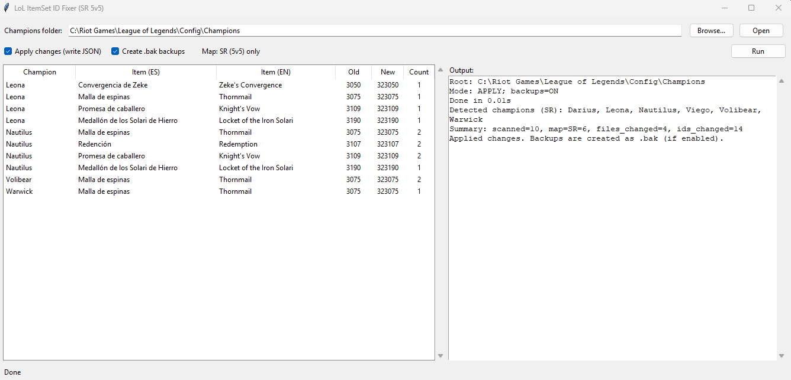

# LoL RIOT ItemSet ID Fixer (SR 5v5)

Small Windows tool to patch League of Legends **recommended item sets** so the in-game casual UI shows full lists.

It scans your `Champions/*/Recommended/*.json` item sets and, **for Summoner's Rift (SR 5v5) only**, replaces selected item IDs (e.g. `3075`) with their SR-variant IDs (e.g. `323075`).

## Why

Some custom recommended item sets may not show all items during casual games on Summoner's Rift.
This tool rewrites specific item IDs inside Riot item set JSON files to their SR-variant IDs, which helps the full list show reliably.

## What it does

- Detects champions by folder name inside `.../League of Legends/Config/Champions`
- Reads `*/Recommended/*.json`
- Only processes files where `"map": "SR"`
- Replaces IDs using an **embedded mapping** (single-file tool)
- Shows a report per champion and per item (Spanish + English names)
- Creates a `.bak` backup next to any modified JSON (unless disabled)

## How to use (recommended: EXE)

1) Download the latest Windows EXE from **GitHub Releases**.
2) Run the EXE (GUI opens).
3) Make sure it points to your `.../League of Legends/Config/Champions` folder.
4) Keep **Apply changes** enabled (and backups ON).
5) Click **Run**.

The table shows champions detected for SR and what items were changed (Spanish + English).

## Screenshots

Main window:

Results table:

